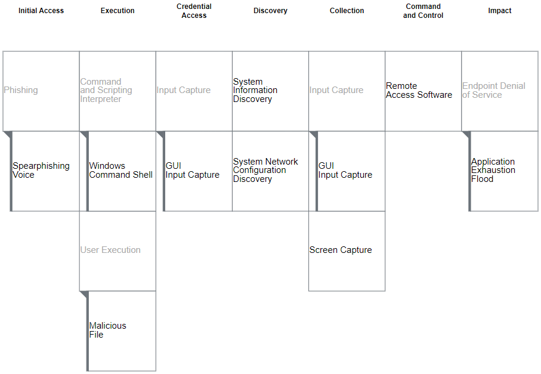

# Black Basta IOCs
- Last update: 09.12.2024
- Author: HvS-Consulting GmbH

## 2024-11
### Context
In the past months a new social engineering campaign linked to Black Basta has been identified. Even though incidents connected to this campaign have been observed by Rapid7 since late April 2024 there has been an increase in reported occurrences of this technique in October and November 2024, e.g. by ReliaQuest, BleepingComputer, and CISA (see References).

This ongoing technique was observed recently in one of our customer's environments as a Microsoft Defender for Endpoint alert was triggered because of a multi-stage incident on one endpoint. The incident involved a user's email inbox being overwhelmed in a short amount of time by a massive amount of legitimate emails, e.g., newsletter subscriptions. This initial impact on the user's device was followed by a social engineering call using Microsoft Teams imitating the company's internal IT helpdesk. Using this spearphishing call the threat actor prompted the affected user to share their screen and the control to their system via Microsoft's built-in remote management tool Quick Assist. 

Once the connection was established, the threat actor downloaded a zip file from the attacker SharePoint to extract and execute the contained StaticEngine.dll in the next stage using Windows Command Shell.

While the execution of the attacker malware triggered different discovery commands, like systeminfo, route print, and ipconfig /all, the user was coerced to input their credentials into a seemingly legitimate prompt.

In this case the threat actor was stopped in the beginning stages of the attack as the quick isolation of the affected endpoint cut off the connection to the attacker. It was observed that the same scheme was initiated against other users of the company after the first attempt failed. The corresponding MITRE ATT&CK techniques are outlined below:

You can find the IOCs either in this repository or on out MISP feed: 
- HvS MISP Feed: https://misp.ir.hvs-consulting.de/feed/unrestricted/
- Blackbasta IOCs 2024-11: https://misp.ir.hvs-consulting.de/feed/unrestricted/c6beadc3-2c06-4e40-92dc-6de2facdd3fb.json

### References
- https://www.reliaquest.com/blog/black-basta-social-engineering-technique-microsoft-teams/
- https://www.bleepingcomputer.com/news/security/black-basta-ransomware-poses-as-it-support-on-microsoft-teams-to-breach-networks/
- https://www.cisa.gov/news-events/cybersecurity-advisories/aa24-131a

## 2024-04
### Context
- The IOCs were gathered during recent investigations of Black Basta incidents.

### References
- Helpful blog post from TrendMicro: https://www.trendmicro.com/de_de/research/24/b/threat-actor-groups-including-black-basta-are-exploiting-recent-.html 

## 2023-11
### Context
- The IOCs were gathered during recent investigations of Black Basta incidents.

## Notes & Disclaimer
- Even if we try to avoid false positives by manual QA, those rules are not meant to be used in production without previous dry runs.
