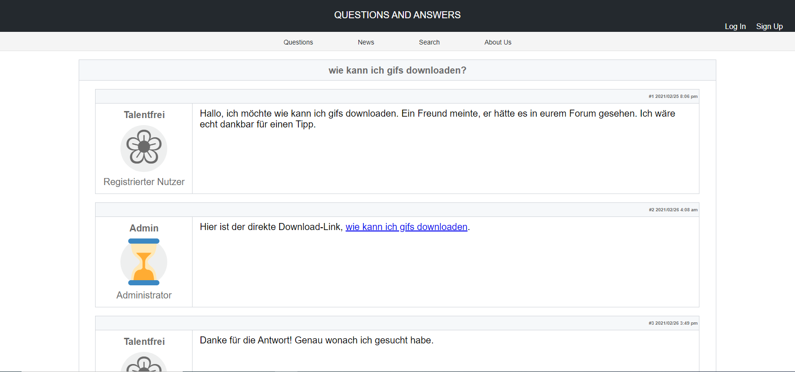
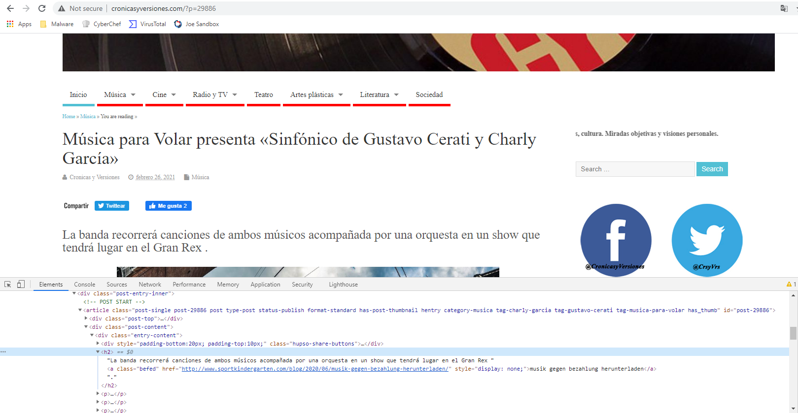
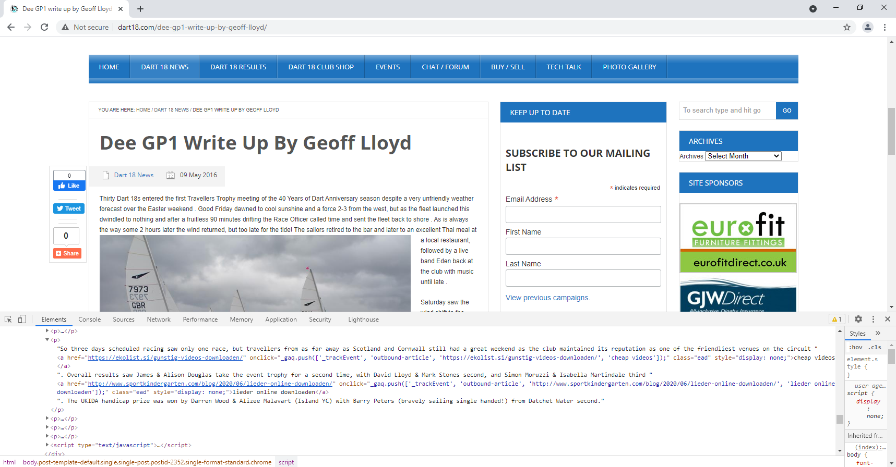

# Gootkit IOCs

- Last update: 10.05.2022
- Author: HvS-Consulting AG

## Context
- We found those IOCs in 2020 investigations of three Gootkit infected systems.
- Furthermore, some internal research revealed the mechanisms used for the distribution of their malware and techniques used for Search Engine Optimization (see next section).

## Distribution of malware and Search Engine Optimization (SEO)
The Gootkit Threat Actor developed a highly effective mechanism to trick users into downloading and executing their malware. By combining a dynamically generated forum and techniques for Search Engine Optimization (SEO), the threat actor is able to convince victims that the download will solve the problem they are currently searching for. This technique can best be described with a real example.

Imagine a non-tech person trying to find out how to download a GIF file. The first thing they will do is to google "How can I download GIFs" or in german "Wie kann ich GIFs downloaden". Since the campaign specifically targeted german-speaking countries, the listed search terms will be in german. Now let's have a look at the results for that search query in Google:

Weird, the **first** result (out of 26.100.000 results) is a blog dedicated to a kindergarden with sports offers. At the moment (11.05.2021), the result is still the second result in the Google ranking. Let that sink in, a small kindergarden has a better SEO than all the technical blogs, news sites, etc. ?!
Let's see what happens if the non-tech person clicks on that link. The first visit of this link will lead to the following web page:

Via an automatic forward, the victim lands on a dynamically generated forum, which shows a user having the same question as used in the Google search term, and an "Admin" helping him to solve his issue. Despite the weird names ("Talentfrei" means "without talent") the forum looks kind of legit at first sight. When clicking on the solution link, the user downloads a Zip file, containing a malware in form of an .js file. The malware has been analyzed and described in-depth by Malwarebytes and Trendmicro (see references). Please note that by early 2021, also the Osiris Banking Trojan was distributed in the same way - a detailed analysis can be found in the reference to Securityboulevard.

A second visit will lead the user to the actual blog post (posted by the attackers):

This is performed by a conditional forward based on the requesting IP address. The blog post itself seems to be a copy of a real tutorial describing how to download GIFs. 

By looking through the blog posts of this website and also of other compromised websites (see ./HvS_Gootkit_2021-05_raw-IOCs.txt), a large but not exhaustive list of search terms could be extracted. The raw IOCs also contain a list of english search terms. Furthermore, some search terms seem to be dutch, which would indicated a third dutch campaign besides the german and the english campaign.

German blog posts/search terms:
- hm app herunterladen  
- gratis ebooks downloaden deutsch 
- freigegebene ordner herunterladen 
- e paper herunterladen 
- bootcamp downloaden voor mac 
- auf ipad filme downloaden 
- amazon prime gekaufte videos herunterladen 
- ard untertitel herunterladen 
- windows 7 ultimate iso download deutsch kostenlos vollversion 
- whatsapp filme kostenlos downloaden 
- spiele kostenlos herunterladen chip 
- shooter kostenlos downloaden 
- photo tan app commerzbank herunterladen 
- musik gegen bezahlung herunterladen 
- microsoft word 2003 kostenlos downloaden chip 
- lieder online downloaden 
- kostenlos downloaden 
- itunes downloaden gratis nederlands 
- film downloaden facebook 
- dazn app windows 10 herunterladen 
- youtube video downloaden iphone 7 
- wie kann ich gifs downloaden 
- virus downloaden gratis 
- transport gigant kostenlos downloaden vollversion 
- ich werde herunterladen 
- gta kostenlos herunterladen pc 
- ansys kostenlos download 
- youtube downloaden apple 
- gekaufte musik herunterladen amazon 
- films downloaden van internet 
- elster steuererklaerung downloaden 
- die sims 3 einfach tierisch download kostenlos vollversion 
- canon scangear herunterladen 
- bagger simulator 2011 vollversion kostenlos downloaden 
- adac pannenhilfe app herunterladen 
- videos aus mediathek downloaden 
- tigertones herunterladen 
- nzb niet te downloaden 
- witze herunterladen 
- star wars pc spiele download kostenlos 
- siri downloaden ipad 
- rtl spiele kostenlos downloaden 
- pocketbook touch lux 3 buecher herunterladen 
- mv app herunterladen 
- minecraft pocket edition zum herunterladen kostenlos 
- lvm app herunterladen 
- kostenlos von youtube downloaden 
- kalender 2020 excel zum herunterladen 
- 15 euro stundenlohn wieviel netto
- nemetschek allplan kostenlos downloaden
- origin herunterladen windows 7
- pou kostenlos downloaden ios
- strafe wegen film herunterladen
- inventor studentenversion herunterladen
- passengers downloaden
- Coole spiele downloaden 
- Wortspiele auf deutsch kostenlos downloaden 
- Tatort münster herunterladen 
- Songs downloaden van youtube 
- Schriftart herunterladen anleitung 
- Ps3 app herunterladen 
- Partition magic deutsch download kostenlos 
- Mp4 herunterladen youtube 
- Latex downloaden 
- Kindle buch von amazon herunterladen 
- Intro musik zum downloaden 
- Amazon prime serien auf mac downloaden
- Bilder vom handy auf pc herunterladen
- Apps kostenlos herunterladen android
- Alle noten kostenlos downloaden
- Foto`s whatsapp downloaden
- Coreldraw graphics suite kostenlos herunterladen
- Herunterladen for youtube
- Google maps europa downloaden
- Ms office 2016 downloaden
- Mewe videos herunterladen android
- League downloaden
- Kindle paperwhite probleme beim herunterladen
- Ios 10.3 3 herunterladen
- Songs zum herunterladen
- Schriftarten downloaden free
- Ps3 spielstände downloaden
- Neue skype version kostenlos downloaden
- Wreckfest kostenlos downloaden
- Win zip kostenlos downloaden
- Website komplett downloaden mac
- Gratis google apps downloaden
- Zune kostenlos herunterladen
- Tinder kostenlos downloaden
- Video aus url downloaden
- Teamfight tactics herunterladen
- Patience gratis downloaden android
- Facebook videos auf handy downloaden
- Downloaden van youtube
- Frozen 2 gratis downloaden
- Film programm kostenlos downloaden
- Deadpool 2 kostenlos herunterladen
- Brand op school de game downloaden
- Amazon prime video app downloaden
- Musik herunterladen günstig
- Microsoft word für mac kostenlos downloaden
- Lightroom 4 gratis downloaden
- Itunes films downloaden op ipad
- Hoe films downloaden op macbook
- Youtube downloader herunterladen
- Windows 8.1 kostenlos downloaden
- Whatsapp herunterladen iphone
- Spiele tablet kostenlos downloaden
- Siedler von catan download kostenlos deutsch
- Raw foto downloaden
- Photoshop cs2 download kostenlos
- Windows 8.1 kostenlos downloaden
- Whatsapp herunterladen iphone
- Spiele tablet kostenlos downloaden

Simply posting real tutorials on unknown websites does not explain the high Google ranking. For improving the Google ranking another interesting technique has been used by Gootkit. As soon as they get access to a more popular website, they simple insert a hidden link to their other compromised websites. See the following screenshots as an examples:

Here, legit articles of the website cronicasyversiones[.]com and dart18[.].com link to the compromised website sportkindergarten[.]com. The link is hidden by setting the style to "display: none". We observed this technique on multiple websites:
- cronicasyversiones[.]com,
- dart18[.]com
- saddleexchange[.]com

Neither the list of search terms (./HvS_Gootkit_2021-05_raw-IOCs.txt), nor the list of compromised websites (./HvS_Gootkit_2021-05_IOCs.csv) is exhaustive. Further analysis and investigations are necessary for creating a complete picture of the network of compromised websites used for malware distribution and improvement of the Google ranking.

We informed the three websites mentioned above and some of the blogs misused for malware distribution. Most blogs do not seem to be maintained anymore and the contacts are therefore not reachable.

## Notes & Disclaimer
- Even if we try to avoid false positives by manual QA, those rules are not meant to be used in production without previous dry runs.

## References
- https://blog.malwarebytes.com/threat-analysis/2020/11/german-users-targeted-with-gootkit-banker-or-revil-ransomware/
- https://www.trendmicro.com/en_us/research/20/l/investigating-the-gootkit-loader.html
- https://securityboulevard.com/2021/02/long-live-osiris-banking-trojan-targets-german-ip-addresses/
- https://thedfirreport.com/2022/05/09/seo-poisoning-a-gootloader-story/